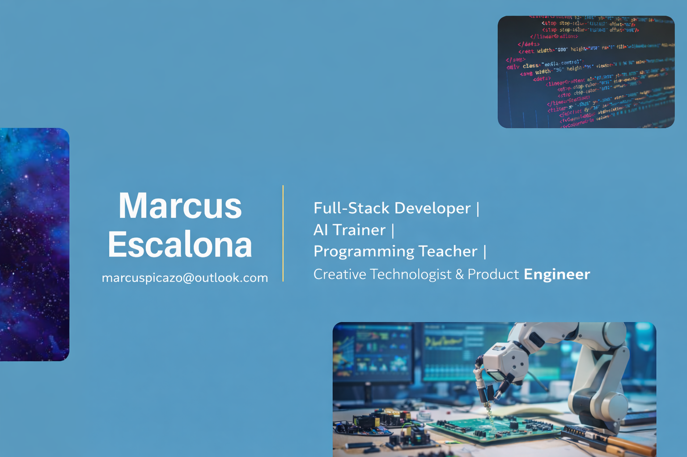

  

# 👋 Hi, I'm **Marcus Escalona**

**Engineering immersive web products through advanced 3D rendering and real-time architectures** *Based in Mexico City, raised in the UK* 

> Passionate about combining **education**, **creativity**, and **technology** to make learning more intuitive and inspiring.

---

## Languages & Communication

---

| Language | Level |
| :--- | :--- |
| **English** | 100% (Native, EF SET C2)   
<progress value="100" max="100"></progress> 
|[🟦🟦🟦🟦🟦🟦🟦🟦🟦🟦] 100%
| **Spanish** | 100% (Native)   <progress value="100" max="100"></progress> |
[🟦🟦🟦🟦🟦🟦🟦🟦🟦🟦] 100%
| **Italian** | Intermediate   <progress value="60" max="100"></progress> |
[🟦🟦🟦🟦🟦🟦⬜⬜⬜⬜] 60%
| **Catalan** | Intermediate   <progress value="60" max="100"></progress> |
[🟦🟦🟦🟦🟦🟦⬜⬜⬜⬜] 60%
 

*Bilingual educator delivering lessons in British English.*

---

## Work Experience

### **Lead Product Engineer & Creative Technologist**
**EBVG | Oct 2023 - Present | Mexico City**
- Architected and deployed interactive EdTech platforms handling 200+ concurrent weekly users.
- Engineered real-time multiplayer ecosystems using React, WebGL, and Firebase (Firestore onSnapshot) for sub-50ms state synchronization.
- Designed "CIT SYNC", a scalable internal management dashboard to orchestrate institutional tech resources.
- Mentored a development team through the "Fábrica de Apps" initiative, establishing modern CI/CD workflows and rigorous code quality standards.

### **Systems Engineer**
**Getting Out | Jan 2022 - Jan 2023 | Mexico City**
- Designed and integrated REST APIs utilizing Python, establishing efficient data pipelines and scalable system architecture.
- Optimized SQL databases and structured data handling processes, significantly reducing data retrieval latency.

### **IT Systems Engineer**
**Cedros College | Jan 2021 - Jan 2022 | Mexico City**
- Managed and optimized institutional digital infrastructure, ensuring secure and efficient operations across internal systems.
- Spearheaded the integration of advanced cybersecurity measures to protect sensitive databases and institutional data.

### **Software Engineer**
**Conaculta - National Council for Culture and Arts | Aug 2016 - Dec 2017 | Mexico City**
- Engineered highly customized software solutions and scalable data architecture for institutional digital platforms.
- Conducted rigorous testing, debugging, and code optimization to ensure robust functionality and data integrity.

### **Digital Audio Engineer & Technical Producer**
**Black Fox Productions | Apr 2020 - Present | Remote**
- Specialized in digital signal processing and high-fidelity audio engineering within remote, distributed digital workflows.
- Applied advanced knowledge of technical acoustics and frequency modulation—skills that directly translate into my current audio-reactive WebGL development.

---

## Education

- **UEM** – *B.S. in Computer Systems Engineering (Completed)*
- **UAM** – *B.S. in Physics (In Progress - Focusing on kinematics, wave physics, and advanced mathematics for 3D engine development)*
- **Universidad Panamericana** – *B.A. in Music and Innovation (Completed)*

***

##  Certifications

- IBM: *Full Stack Developer*, *AI with Python*, *Data Science* - Google: *Project Management*, *Data Analytics*, *Digital Marketing & E-Commerce* - Berklee College: *Music Production*, *Business Foundations*, *Jazz Improvisation* - UNAM: *Psychological First Aid*, *Forensic Accounting*, *Artistic Movements* - EBAC & Escuela Directa: *Unity Game Dev, JavaScript, Python, SQL* - EF SET: *C2 English Proficiency Certificate*

---

##  Technical Skills

### 💻 Programming
`HTML` · `CSS` · `JavaScript` · `Python` · `SQL`· `WebGL`· `Typescript`· `React`· `Three.js`· `Node.js`

###  Data & AI
Machine Learning · Data Science · AI Development · Database Management

###  Systems & IT
IT Project Management · Software Design & Debugging

###  Audio/Video
Mixing & Mastering · Video Editing · Lighting & Camerawork

###  Soft Skills
Problem Solving · Teamwork · Communication · Training & Mentoring

---

## Volunteer Work
**Animalitos Plateros** (Mexico City)  
🐾 Supporting street animals through rescue, shelter, and adoption initiatives.

---

  

## Connect with Me

  

---

  <i>Thanks for visiting my profile! Feel free to collaborate, fork, or connect!</i>  
  📧 <a href="mailto:marcuspicazo@outlook.com">marcuspicazo@outlook.com</a> 
  🌐 <a href="https://marcusescalona.art" target="_blank"><b>marcusescalona.art</b></a>

