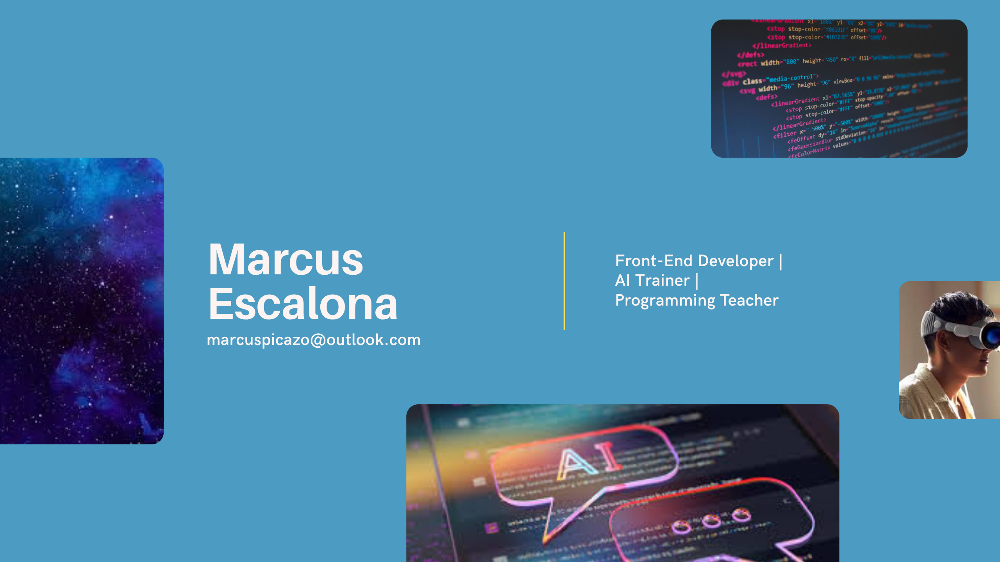

  

# 👋 Hi, I'm **Marcus Escalona**

**Front-End Developer | AI Trainer | Programming Teacher**  
 *Based in Mexico City, raised in the UK* 

> Passionate about combining **education**, **creativity**, and **technology** to make learning more intuitive and inspiring.

---

## Languages & Communication

---

| Language | Level |
| :--- | :--- |
| **English** | 100% (Native, EF SET C2)   
<progress value="100" max="100"></progress> 
|
| **Spanish** | 100% (Native)   <progress value="100" max="100"></progress> |
| **Italian** | Intermediate   <progress value="60" max="100"></progress> |
| **Catalan** | Intermediate   <progress value="60" max="100"></progress> |
 
 

*Bilingual educator delivering lessons in British English.*

---

##  Work Experience

###  **Computer Science and Tech Educator**  
**Berta Von Glümer | 2023 - Present | Mexico City**  
- Teach programming and algorithms to primary & secondary students.  
- Integrate English language development through technical learning.  

### **Front-End Developer / Interpreter / Engineer**  
- **AMN Health Care** – Interpreter (EN/ES medical communication).  
- **Adidas USA & UK** – Bilingual Customer Support Representative.  
- **Westlake Consumer Credit** – Claims & Banking Representative.  
- **Getting Out / Cedros College** – Systems Engineer (software development & cybersecurity).  

###  **Audio & Media Production**  
- **Black Fox Productions** – Audio Engineer (remote, global clients).  
- **Black Media Productions** – Audio & Video Assistant (worked with LATAM voice actors).  
- **CONACULTA / Secretaría de Cultura** – Video Editor & Audio Engineer.  
- **Proyecto Sirenas** – Photographer & Lighting Director (awareness campaign on femicides).  

---

##  Education

 **Universidad Panamericana** – *B.A. in Music and Innovation*  
 **Tiffin University (USA)** – *B.S. in Software Engineering* *(Scholarship for Latino Students)*  
 **G Martell** – *Audio Engineering (in progress)*  
**UTC** – *Criminology and Criminalistics (in progress)*  
 **UAM** – *Engineering in Physics (in progress)*  
 **VIU (Spain)** – *Master’s in Astrophysics and Astronomy (in progress)*  

---

##  Certifications

- IBM: *Full Stack Developer*, *AI with Python*, *Data Science*  
- Google: *Project Management*, *Data Analytics*, *Digital Marketing & E-Commerce*  
- Berklee College: *Music Production*, *Business Foundations*, *Jazz Improvisation*  
- UNAM: *Psychological First Aid*, *Forensic Accounting*, *Artistic Movements*  
- EBAC & Escuela Directa: *Unity Game Dev, JavaScript, Python, SQL*  
- EF SET: *C2 English Proficiency Certificate*

---

##  Technical Skills

### 💻 Programming
`HTML` · `CSS` · `JavaScript` · `Python` · `SQL`

###  Data & AI
Machine Learning · Data Science · AI Development · Database Management

###  Systems & IT
IT Project Management · Software Design & Debugging

###  Audio/Video
Mixing & Mastering · Video Editing · Lighting & Camerawork

###  Soft Skills
Problem Solving · Teamwork · Communication · Training & Mentoring

---

## Volunteer Work
**Animalitos Plateros** (Mexico City)  
🐾 Supporting street animals through rescue, shelter, and adoption initiatives.

---

## 🌐 Connect with Me

  

---

 *Thanks for visiting my profile! Feel free to collaborate, fork, or connect!*  
 marcuspicazo@outlook.com
